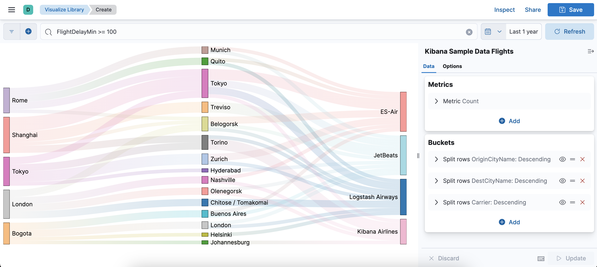

# Kibana Sankey Diagram Plugin

This is a sankey diagram visType plugin for Kibana.

The plugin is compatible with Kibana: 5.3 && 6.x && 7.x && 8.10.x .

This plugin was developed from <https://github.com/elastic/kibana/pull/4832>.

Here is an example:



# Install

```
git clone https://github.com/uniberg/kbn_sankey_vis.git sankey_vis
cd sankey_vis
yarn install
yarn compile
yarn start
```
# Use
In development mode:
* Navigate to Kibana (http://localhost:5601).
* Go to "Visualize Library" app.
* Click "Create visualization".
* Click "Aggregation Based".
* Choose "Sankey Diagram"
# Uninstall

```
bin/kibana-plugin remove kbn-sankey-vis
```

# Building a Release
Building a release only means packaging the plugin with all its dependencies into a zip archive. Important is to put the plugin in a folder called kibana before zipping it.
The following steps would produce a release of the current head master branch.
```
mkdir kibana
git clone https://github.com/uniberg/kbn_sankey_vis.git sankey_vis
cd sankey_vis
[optional] git checkout -branch
yarn install
yarn compile-and-build
```
